# Battleship

The script allows the user to play a game of Battleship according to [Hasbro's rules](https://www.hasbro.com/common/instruct/battleship.pdf) against the computer.

The user is first prompted to place 5 ships of varying lengths on an 8x8 grid. The computer does the same without showing the placement of its ships to the user.

The user and the computer then alternate trying to hit as many of the opponents ships as possible. The computer uses its previous hits to try and guess at the position of the user's ships.

The code is deployed in a Heroku app simulating a terminal [here.](https://prattleship-f21ed515ab85.herokuapp.com/)

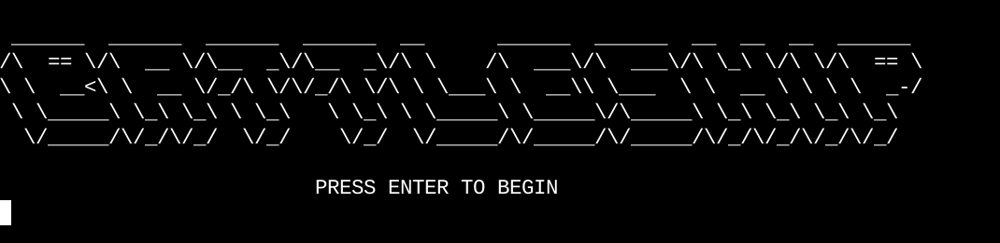

<!-- TOC start (generated with https://github.com/derlin/bitdowntoc) -->

- [Battleship](#battleship)
  - [Project Goals](#project-goals)
  - [Structure](#structure)
    - [Placing Ships](#placing-ships)
    - [Sinking Ships](#sinking-ships)
      - [How the Computer Chooses Targets](#how-the-computer-chooses-targets)
  - [Features](#features)
    - [Existing Features](#existing-features)
      - [Placing Ships](#placing-ships-1)
      - [Sinking Ships](#sinking-ships-1)
    - [Planned Features](#planned-features)
      - [Placing Ships](#placing-ships-2)
      - [Sinking Ships](#sinking-ships-2)
  - [Testing](#testing)
    - [General](#general)
    - [Placing Ships](#placing-ships-3)
    - [Sinking Ships](#sinking-ships-3)
    - [Code Validation](#code-validation)
  - [Deployment](#deployment)
  - [Credits](#credits)

<!-- TOC end -->

---

## Project Goals

I attempted to create a game which allows the user to play Battleship according to Hasbro's rules with a computer that chooses its targets strategically rather than randomly.

Before starting, I had the following requirements in mind:

- Both the player and the computer should be able to place five ships of varying sizes onto the board
- The ships should not be visible to the user and their placement should not directly factor into the choice of target for the computer
- Both the player and the computer should be able to target points on the board they have not yet targeted
- Both the player and the computer should receive feedback on if their target was a hit or a miss
- The computer should use prior hits and misses as a guideline for choosing future targets

[Back to Top ↑](#battleship)

## Structure

The game consists of two distinct phases: placing the ships and targeting the ships.

### Placing Ships

The logic of the first phase of the game when the ships are placed is illustrated with the flowchart below.

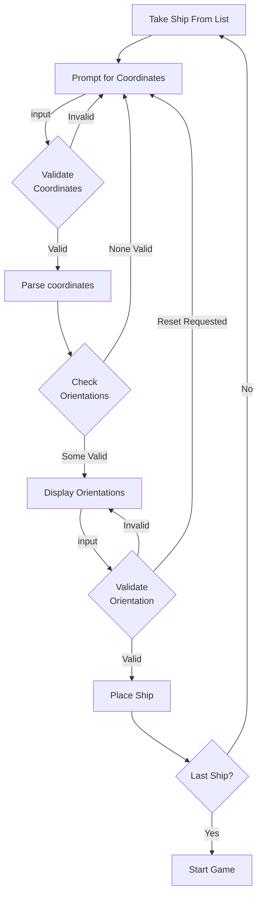

The ship list consists of five ships:

- Carrier: Length 5
- Battleship: Length 4
- Cruiser: Length 3
- Submarine: Length 3
- Destroyer: Length 2

The user is prompted to place each ship in order of length.

The programme requires a set of coordinates consisting of a row number and a column letter. The input tolerates any order, both lower and upper case, as well as trailing spaces or whitespace between the characters.
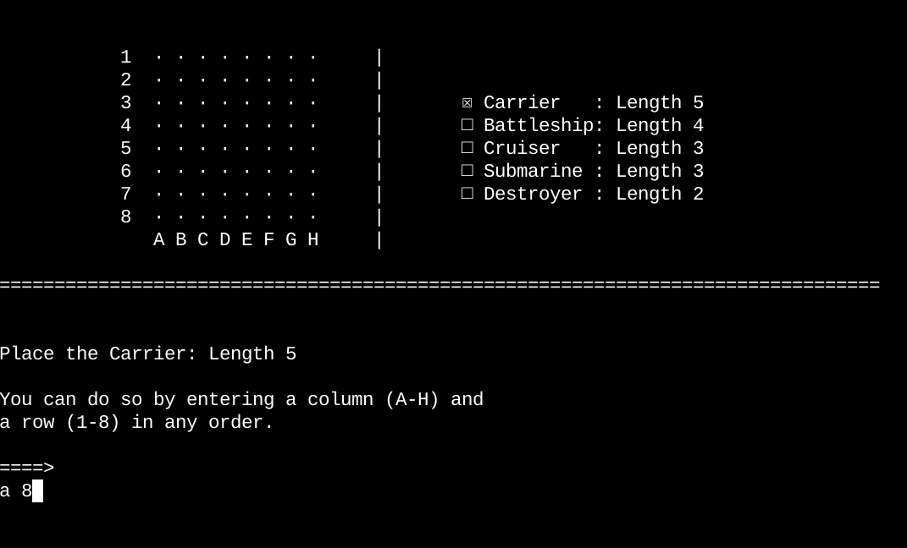

If the input cannot be parsed, the user is shown an error message informing them whether there are too many non-whitespace symbols in the input, whether they did not include a letter or whether they failed to include a number.
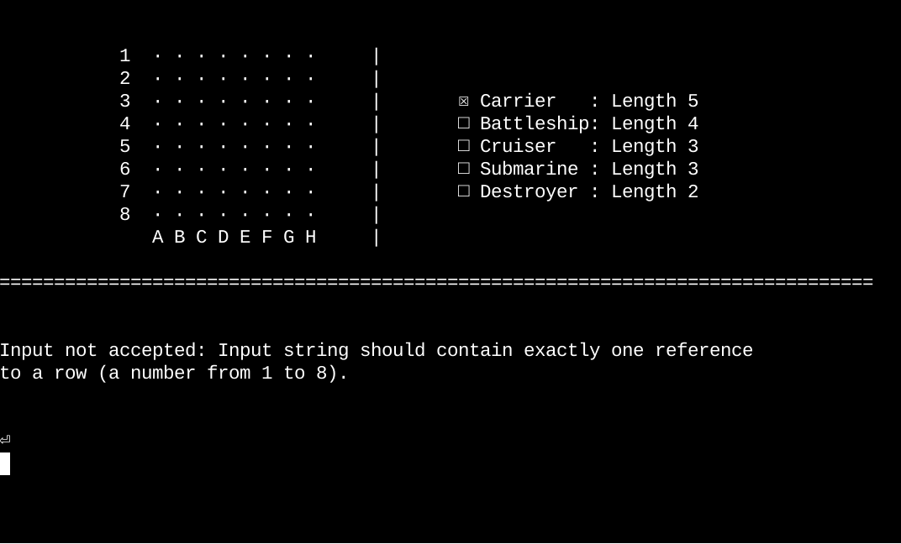

If the input can be parsed, the programme checks whether there is a legitimate direction from the starting point the ship can be placed in without going out of bounds or colliding with a ship that was already placed.

If there is no valid orientation for the ship, the user is re-prompted to enter a set of coordinates.
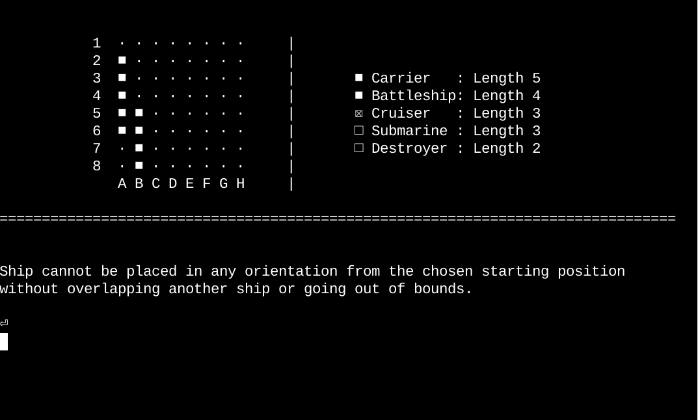

If there is at least one valid orientation, any valid orientations are displayed on the board and the user is prompted to enter one. The user can also enter `C` to reset the ship placement and re-enter the coordinates if they change their mind or if they mistyped.
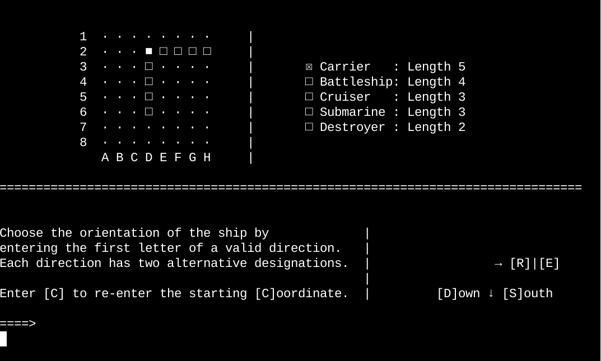

If a user enters an invalid input, they are prompted to try again.
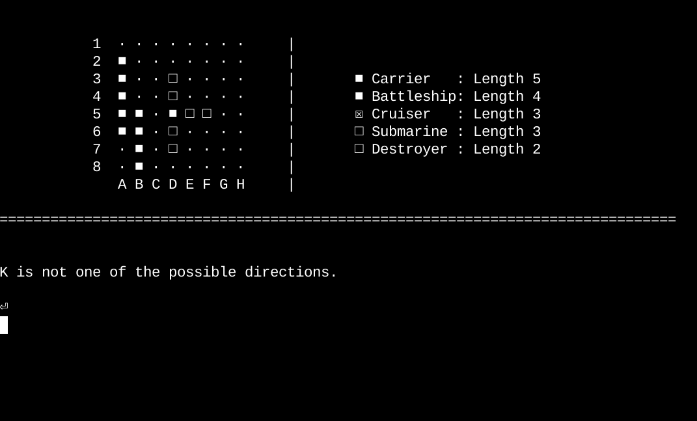

Otherwise, the ship is placed on the board and the user is prompted to place the next ship and so on, until all five are placed.

The process for placing ships on the computer's board is identical, except the board state is not shown to the user. The computer picks the initial coordinate randomly until it hits upon one with at least one valid orientation for the ship. It then places it in a random orientation.

The user only sees a screen informing them that the computer is placing its ships.
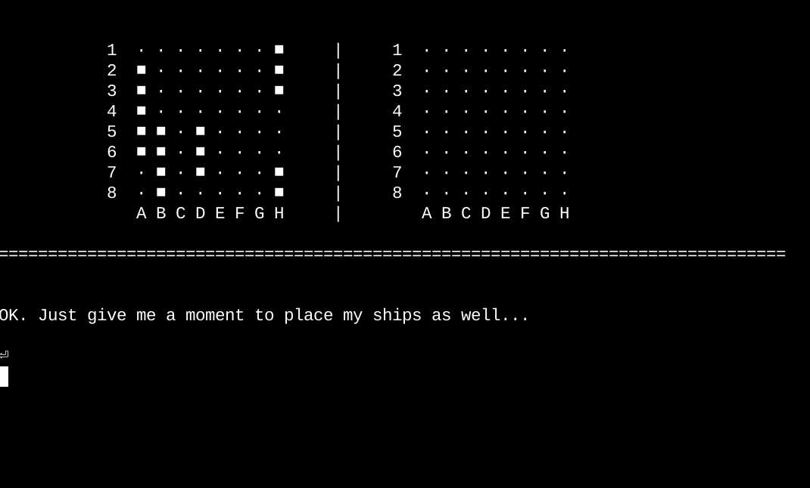

[Back to Top ↑](#battleship)

### Sinking Ships

After the ships are placed, the game enters the second phase, where the player and the computer take turns choosing coordinates to target. The logic of this phase is shown in the flowchart below.

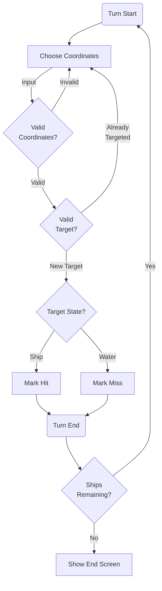

Each turn goes the same for the user and the computer.

Both choose coordinates. How the computer does so will be explained below. The user inputs a set of coordinates with the same conditions as when they were placing the ships: one letter for the column; one number for the row; whitespace, case and different order tolerated.

Once the input is validated, the programme checks if the user is retargeting a spot they already targeted. If so, an error is thrown and the user is prompted to re-enter a set of coordinates.
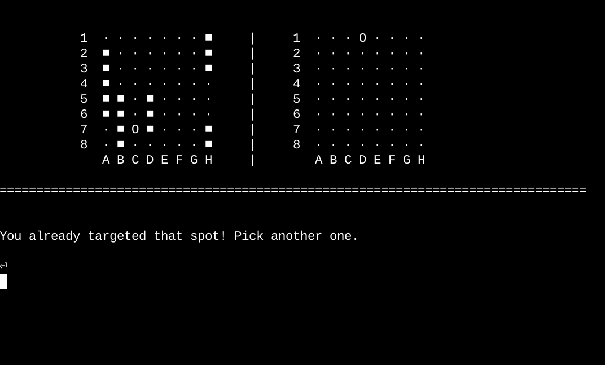

If the input is both valid and targeting a new spot, the programme checks whether it was a hit or a miss, marks the board accordingly and displays a message from the computer.
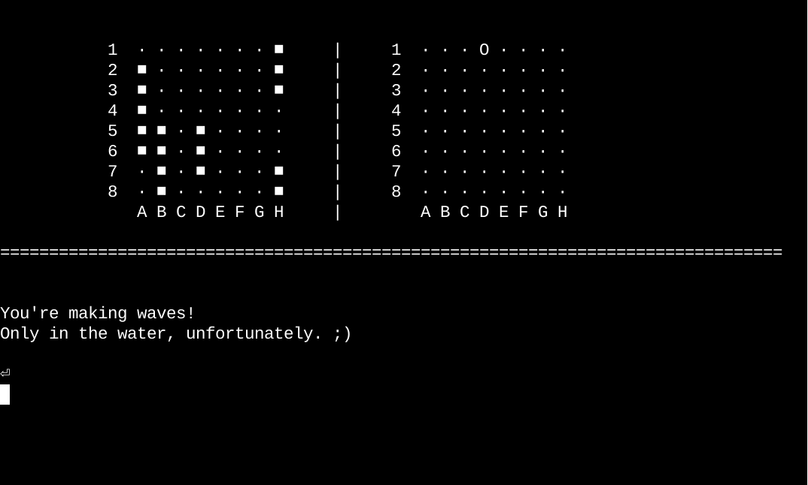

Whenever either the user or the computer runs out of ships, the game is ended and a victory or a defeat screen is shown, with a prompt to play again.
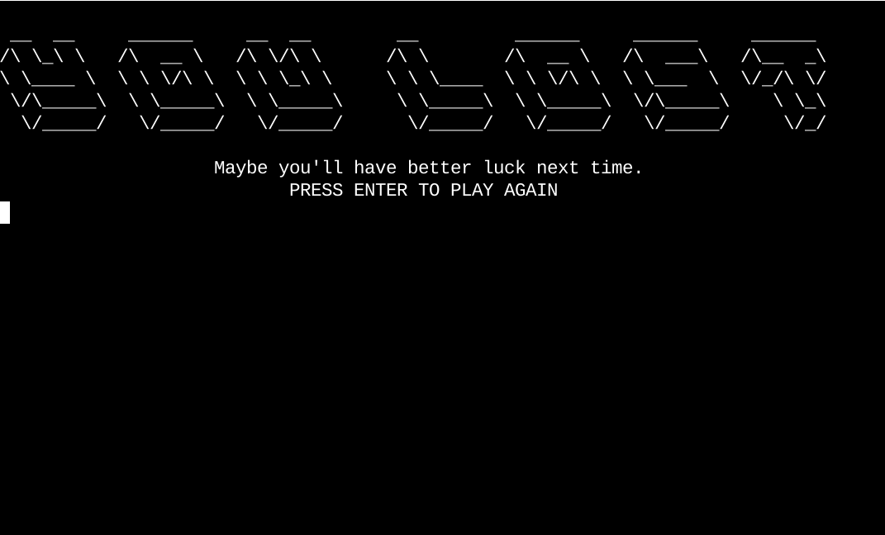

#### How the Computer Chooses Targets

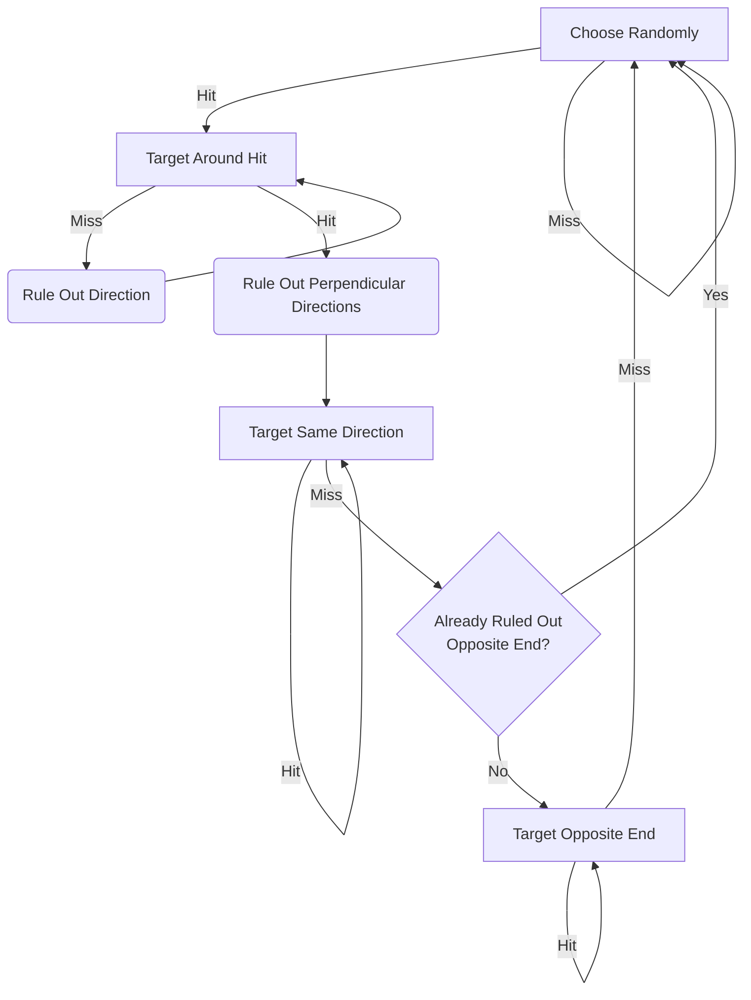

The computer starts by randomly selecting a set of coordinates. It falls back on the same strategy whenever it has no chains or starting points to use as a guide.

Once the computer hits a ship, the coordinates of the hit are treated as a starting point. On its next turn, the computer will try to target the coordinates adjacent to the ones it hit already, trying to identify the orientation of the ship.

Any time it misses, it rules out a single direction.

As soon as it hits, it remembers a chain and rules out the directions perpendicular to the direction it got a hit in and, on its next turn, continues targeting coordinates in the same direction. It continues to do so until it misses.

If it has not already ruled it out when hitting blindly around the starting point, it then tries to hit the opposite end of the chain, meaning it goes back to the starting point and targets the opposite direction to the one it was following previously. As soon as it misses in that direction, it forgets the chain and goes back to choosing randomly.

[Back to Top ↑](#battleship)

## Features

### Existing Features

#### Placing Ships

- Interface for placing ships
- Automatic filtering of possible orientations
- Placement preview
- Option to reset
- Input validation

#### Sinking Ships

- Interface to target coordinates
- Hit checking
- Feedback message from computer
- Input validation
- Retargeting error
- Computer logic including
  - Random selection of coordinates
  - Tracking previous hits as starting points
  - Using starting points to identify direction
  - Tracking and following direction until miss

### Planned Features

#### Placing Ships

- Selecting direction with arrow keys
- Better error handling

#### Sinking Ships

- Better error handling
- Computer logic including
  - Remembering misses to spread out guesses
  - Bearing ship lengths in mind when choosing target

[Back to Top ↑](#battleship)

## Testing

### General

| Test                                                                                             | Pass |
| ------------------------------------------------------------------------------------------------ | ---- |
| Game screen displayed correctly                                                                  | ✓    |
| When no input is required, pressing enter advances screen                                        | ✓    |
| When input is required, pressing enter processes input                                           | ✓    |
| Entering input with more than 2 non-whitespace characters when choosing coordinate returns error | ✓    |
| Entering input without column letter when choosing coordinate returns error                      | ✓    |
| Entering input without row number when choosing coordinate returns error                         | ✓    |
| The user's board displays ships, but the computer's does not                                     | ✓    |

### Placing Ships

| Test                                                                         | Pass |
| ---------------------------------------------------------------------------- | ---- |
| Ship list updates to indicate ship currently being placed                    | ✓    |
| Choosing a starting coordinate with no valid ship placements returns error   | ✓    |
| Possible orientations are displayed, both as arrows above input and on board | ✓    |
| Entering invalid orientation returns error                                   | ✓    |
| Entering valid orientation places ship appropriately on the board            | ✓    |
| Entering <C> allows user to re-enter starting coordinate                     | ✓    |
| After all ships are placed, the final state of the board is shown            | ✓    |
| The computer automatically places all its ships on valid points              | ✓    |

### Sinking Ships

| Test                                                                              | Pass |
| --------------------------------------------------------------------------------- | ---- |
| If a point containing a ship is targeted, a hit is registered                     | ✓    |
| If a point not containing a ship is targeted, a miss is registered                | ✓    |
| The computer displays messages appropriate to the outcome of the turn             | ✓    |
| The computer chooses random targets without falling into infinite loops           | ✓    |
| The computer remembers starting points and targets points around them             | ✓    |
| The computer follows the direction of a ship once it has determined it            | ✓    |
| The computer tries the opposite end of a ship once it misses                      | ✓    |
| The computer returns to random point selection after chains of hits are exhausted | ✓    |

[Back to Top ↑](#battleship)

## Code Validation

- I used the [CI PEP8 validator site](https://pep8ci.herokuapp.com/) to check my code.
  - Most formatting issues resolved by installing `autopep8` and formatting on save later on in the project.
  - Initially many lines were over 79 characters long, which was rectified manually.
  - No issues shown in final version of code.
    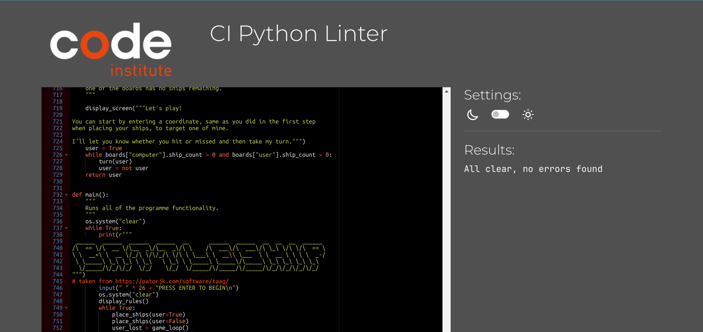

[Back to Top ↑](#battleship)

## Deployment

The project is deployed on Heroku. The terminal is displayed in the browser using the code from the [CI P3 Template](https://github.com/Code-Institute-Org/p3-template).

[Back to Top ↑](#battleship)

## Credits

- [CI P3 Template](https://github.com/Code-Institute-Org/p3-template) used as basis
- [Hasbro's rules](https://www.hasbro.com/common/instruct/battleship.pdf) used as basis for the ruleset
- [patorjk's ASCII art generator](https://patorjk.com/software/taag/) was used to generate the block text

[Back to Top ↑](#battleship)

## Acknowledgements

- Marta, for tolerating my often changing, inconsistent and time-consuming life and career plans.

- My sister, for helpful if aggressive tips on improving the UX.

- My family, for their useful feedback and inevitable joshing.

- My tutor, Marcel, for his patience, notes, feedback, encouragement and clear, precise pointers on what to focus on in moments of total disorientation.

- Code Institute for teaching me what I needed to know to make this game happen.

[Back to Top ↑](#battleship)
